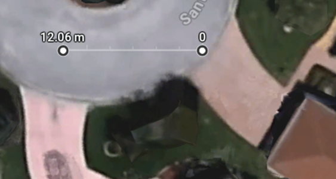

# Plan for a simple loop in the street

* Start from Home point (0) in the street near the center of my drive
    * Lat, Lon = 28.924720, -81.969660
* Drive to Goal point, located 12 m East of Home
    * Lat, Lon = 28.924720, -81.969780
* Upon readhing Goal (within 2 m), Turn hard left and drive to Home
* Upon reaching Home (within 2 m), turn hard left and drive to Goal

