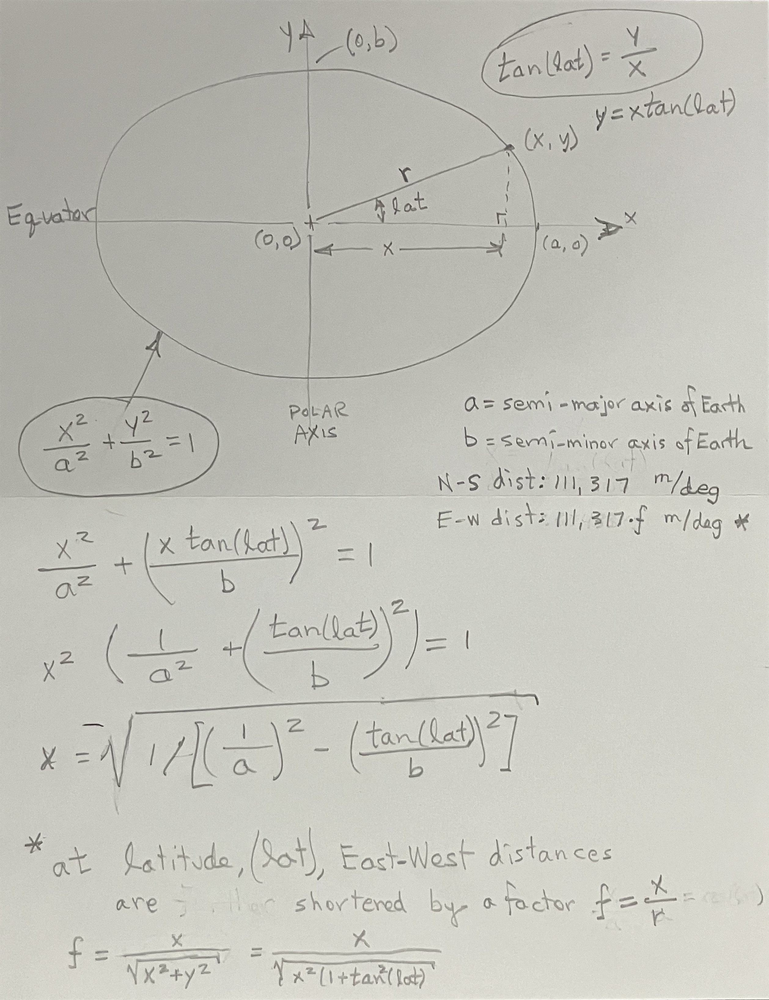
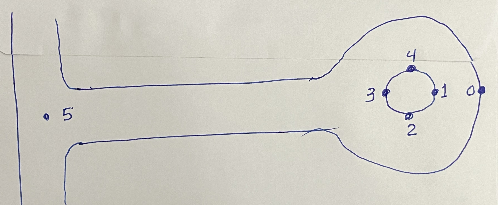

# Notes on GPS project

## Goal is to build an outdoor robot car that can navigate autonomously.
* This should give me an opportunity to implement a Kalman filter to fuse wheel odometry data with gps location measurements and orientation data from an IMU.
* Using the code provided at this tutorial [NEO-6M GPS Module with Raspberry Pi Pico | Micropython](https://diyprojectslab.com/neo-6m-gps-with-pi-pico/), I got my gps module producing data on a Pi Pico.
    * [micropyGPS.py (library)](micropyGPS.py)
    * [main.py](main.py)

## I need to convert Lat / Long values from GPS to X / Y coordinates (in meters)
* [Conversion of Latitude and Longitude to UTM Coordinates](https://www.ccgalberta.com/ccgresources/report11/2009-410_converting_latlon_to_utm.pdf)

* Equations of [the Elipse](https://openstax.org/books/college-algebra-2e/pages/8-1-the-ellipse)

#### Based on the idea of using a UTM-type projection
* Latitude to distance conversion (N-S distance) works out to: 111,317 m / deg
    * Based on Earth_diameter = 12,756,000 m
* Longitude conversion (E-W distance) is the same at the equator, but is shortened by a factor **f** depending on latitude **lat**
    * My local latitude is **28.925 deg**

* [gps_calcs.py](gps_calcs.py) shows these calculations
* I made a few measurements on our street.

* The [gps-calcs spreadsheet](gps-calcs.ods) shows these points converted to meters and displayed.
* The 89 m distance from point 0 to 5 agrees favorably with the distance shown on Google Earth, so apparently my math is OK.

