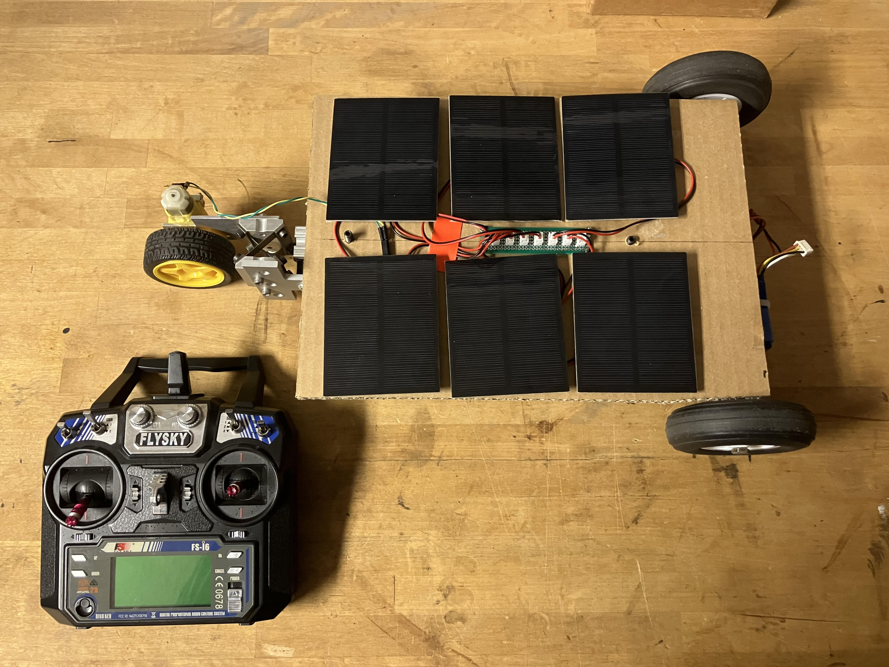
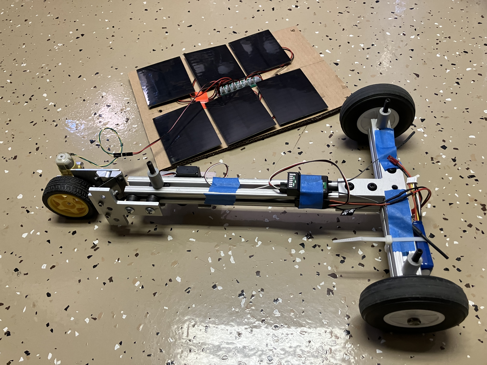
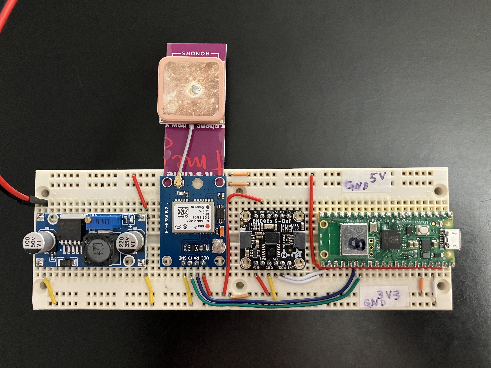
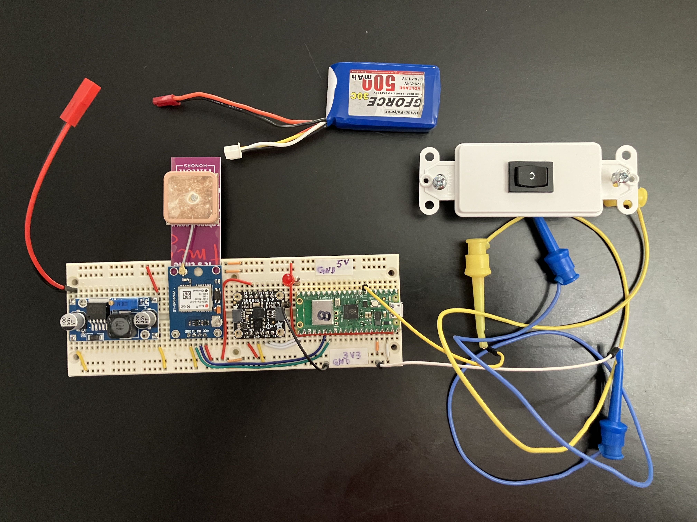
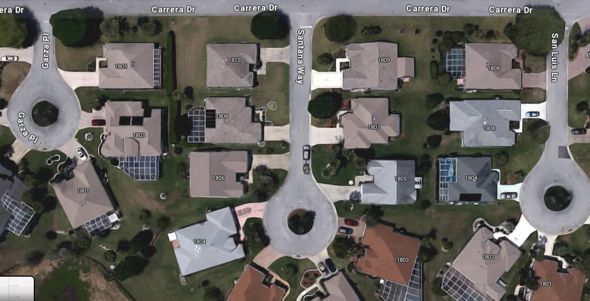

# Solar Trike *Earth Rover* (with R/C steering control)
* Locomotion powered *Solely* by *Solar*

## Project goal: Replace R/C steering control with pre-programmed (waypoint to waypoint) navigation using an onboard PICO microcontroller
* Pose data comes from GPS & IMU
* Pico coordinates everything:
    * Power comes from an onboard 3S (11.7v) LiPo battery
    * Buck converter to (5V)
    * gps (X-Y location)
    * Bosch BNO08x IMU (theta-Z orientation)
    * Calculates steering to next waypoint
    * Controls steering servo to follow path to next waypoint.
        * can loop or drive to a destination

* Hook up a switch to trigger collection of GPS data

* GPS data collected at seven spots nearby
    * Eastern-most corner of my garage
    * 2 corners of my driveway (at gutter)
    * 2 man-hole covers on Carrera (@ Santana & San Luis)
    * 2 man-hole covers at circles on Santana & San Luis

## Compare measured Lat/Lon coords with Google Map coords
* [GPS Calibration](gps-calib.ods) spreadsheet compares measured Lat/Lon coordinates with coords shown on Google Maps for several man-hole covers in the neighborhood.
    * The spreadheet converts Lat/Lon coords to X and Y values using the method explained [here](gps/notes.md)
    * Origin of the X-Y coordinates is set at the man-hole cover on Carrera at Garza.
    * Measured values are within a couple meters of map values
 
## Coordinate Frames

* It is S.O.P. for a robot in its **Home** position to be located at the **Origin** (0, 0) of the coordinate frame of its **World**, with its own **Local** coordinate frame initially superimposed thereon.
* Until the robot leaves its Home, it is poised to go forward in the X direction with a theta-Z value = 0.
    * The robot's initial **Pose** is (X, Y, theta-Z) = (0, 0, 0).
* It is convenient for our robot's **Home** position to be centered in the doorway of the garage with its **X** axis pointed out toward the street.
* After the robot leaves its Home position, it's own **Local** coordinate frame moves with it, while its **World** coordinate frame stays put.

### Transforming from Lat/Lon to Easting/Northing to X/Y Reference Frame

* **GPS** technology is wonderful for allowing our robot to figure out where it is, but we have to do a couple of transformations to get our desired X, Y coordinates in meters.
    1. First we declare the Latitude / Longitude of our chosen **Home** poistion to be our **reference** coordinates. All other Lat/Lon coordinates are considered to be relative to the coordinates of our Home positon.
    2. With the Home position as the origin, we can come up with a 2D frame which looks like a normal map, with East-West direction along the horizontal axis and North-South direction along the vertical direction.
        * A **Northing** value (meters) is calculated from the latitude of any other location.
            * Measuring the Earth's circumference **C** in a longitudinal direction allows us to come up with a pretty simple relationship between latitude and Northing distance that holds true everywhere.
        * An **Easting** value (meters) is calculated from the longitude of any other location.
            * This isn't as simple. At the equator, you would have to travel a great distance East or West to get back to where you started, but if you are near one of the poles, you only have to travel a much shorter distance to get back to your starting point. So you have to know your latitude in order to know the distance around the world in the E/W direction.
    3. Finally, we get our desired X/Y coordinate frame by rotating the Easting/Northing map 148 degrees CCW about the origin..
## Next up: We need to come up with a steering algorithm

* This [path folowing video tutorial](https://www.youtube.com/watch?v=2qGsBClh3hE) shows (at 7:00) a nice animation of a path following algorithm credited to [Craig Reynolds](https://www.red3d.com/cwr/steer/)

