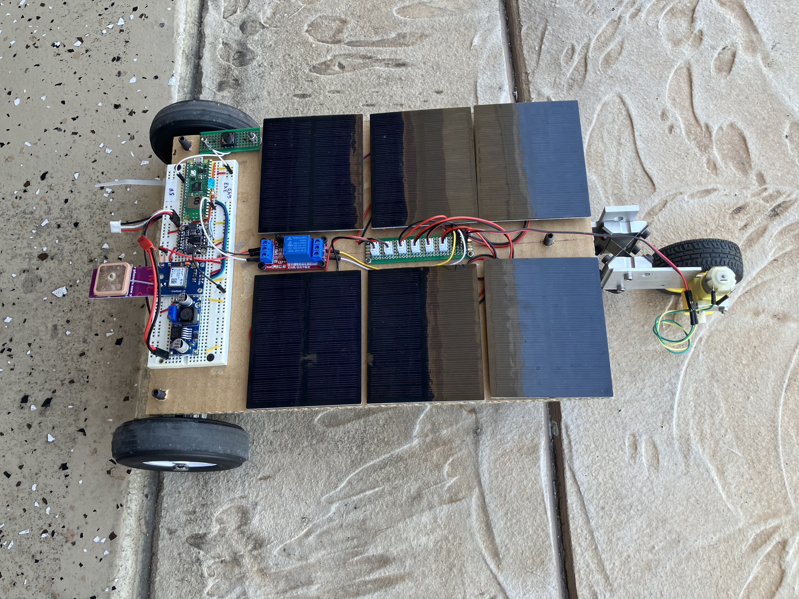
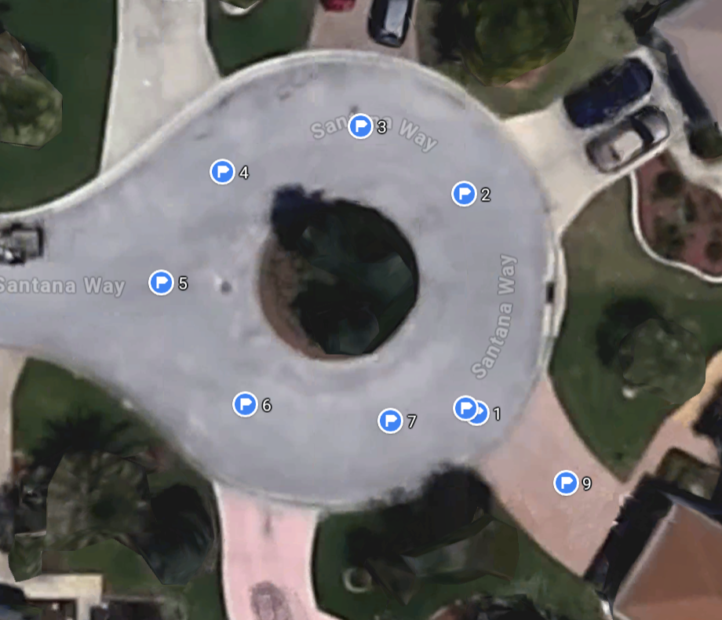

# Solar Powered *Outdoor* Trike
* Locomotion powered *solely* by *Solar*
* Steering is controled R/C (operator controlled)
    * A small Li-Po battery powers the R/C reciever and steering servo

## Project goal: Replace R/C steering control with pre-programmed (waypoint to waypoint) navigation using an onboard PICO microcontroller
* Pose data comes from GPS & IMU
* Pico coordinates everything:
    * Power comes from an onboard 3S (11.1v) or 2S (7.4V) LiPo battery
    * Buck converter to (5V)
    * gps (X-Y location)
    * [Bosch BNO08x](https://cdn-learn.adafruit.com/downloads/pdf/adafruit-9-dof-orientation-imu-fusion-breakout-bno085.pdf) IMU ($\theta$-Z orientation)
    * Calculates steering to next waypoint
    * Controls steering servo to follow path to next waypoint.
        * can loop or drive to a destination
        * Upon arrival at final waypoint in list, a relay cuts the solar power

## [Collecting GPS data](collecting_gps_data.md)

## Converting GPS coordinates to a local X, Y Coordinate Frame
* It's typical practice for a robot in its **Home** position to be located at the **Origin** (0, 0) of its **World** coordinate frame, with its own **Local** coordinate frame initially superimposed thereon.
    * This is ideally suited to robots that use wheel odometry to reckon their location. (Our robot doesn't need to do that. It uses GPS for its location.)
* Until the robot leaves its Home, it is poised to go forward in the X direction with a theta-Z value = 0.
    * The robot's initial **Pose** is (X, Y, theta-Z) = (0, 0, 0).
* **However, in the case of this robot** it isn't neccesary that the robot's Home position must be located in any particular place, but **it is important that the IMU yaw = ZERO** when the robot is facing in the X-direction.
    * It is important for the robot to have an IMU that gives reliable values for its Theta-Z orientation **without drift**

### Transforming from Lat/Lon --> Easting/Northing --> X/Y Reference Frame

* **GPS** technology is wonderful for allowing our robot to figure out where it is, but we have to do a couple of transformations to get our desired X, Y coordinates in meters.
    1. First we declare the Latitude / Longitude of our chosen **Home** postion to be our **reference** coordinates. All other Lat/Lon coordinates are considered to be relative to the coordinates of our Home positon.
    2. With the Home position as the origin, we can come up with a 2D frame which looks like a normal map, with East-West direction along the horizontal axis and North-South direction along the vertical direction.
        * A **Northing** value (meters) is calculated from the latitude of any other location.
            * Measuring the Earth's circumference **C** in a longitudinal direction allows us to come up with a pretty simple relationship between latitude and Northing distance that holds true everywhere.
        * An **Easting** value (meters) is calculated from the longitude of any other location.
            * This isn't as simple. It also depends on  your latitude. At the equator, you would have to travel a great distance East or West to go 360 degrees and get back to where you started, but if you are near one of the poles, you only have to travel a much shorter distance to get back to your starting point. So you have to know your latitude in order to know the distance around the world in the E/W direction.
    3. Finally, set the X/Y coordinate frame at the desired rotation. Zero rotation would align the X-axis to the East (Y-axis to the North). If it is desired to have the X-axis square to the face of the garage as shown above, the Easting/Northing map would need to rotate 148 degrees CCW about the origin.

## Test drive CCW around circle
* The picture below shows the locations of waypoints numbered 1 through 9.

* At power-up, robot orientation must be aligned along the desired X-axis (square to the face of the garage)
* After power-up, the onboard led flash's quickly, until the start button is pressed.
* Once the start button is pressed, the robot then waits until the GPS module is providing good 3D fixes
* Once valid GPS values are produced:
    * a relay closes, allowing solar power to the motor
    * robot steers toward the first waypoint
    * upon arrival at the waypoint, the current waypoint is set to next in list.
    * upon arrival at the final waypoint, relay cuts power to the motor and program exits.

### This is how I did the [steering](steering.md)
