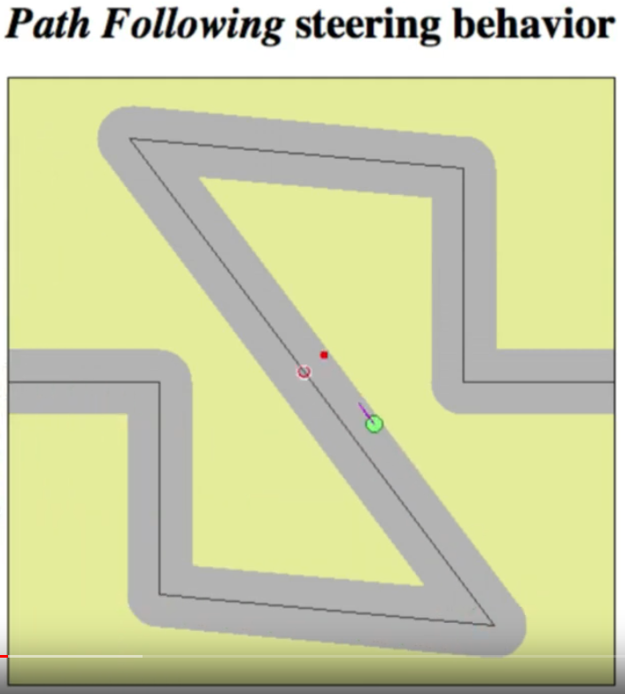

# Path following & steering

* Some online research turned up this [path folowing video tutorial](https://www.youtube.com/watch?v=2qGsBClh3hE) shows (at 7:00) a nice animation of a path following algorithm credited to [Craig Reynolds](https://www.red3d.com/cwr/steer/)

## I ended up using something even cruder than this.
* With each GPS location, I simply:
    * Calculated the **Relative Bearing** to the target waypoint
        * If the relative bearing of the target was a little bit off to the right, it would steer a little bit to the left
        * If the relative bearing of the target was a lot off to the right, it would steer harder to the left
    * Then multiplied the bearing angle by the STEERING_GAIN (0.6)
    * Applied this angle to the steering wheel.
* This actually worked OK.
